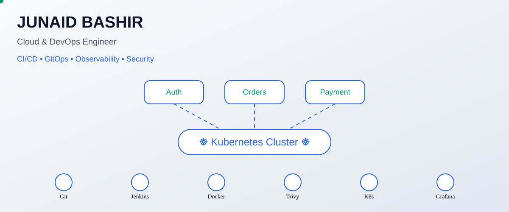

<picture>
  <source
    media="(prefers-color-scheme: dark)"
    srcset="./dark_mode.svg">

  
</picture>

# ☁️ Designing scalable infrastructure and AI-driven automation

### ☁️ Cloud & DevOps Engineer

**Cloud Infrastructure • Platform Engineering • DevSecOps • GenAI**

---

## 💫 Who I Am

> Cloud & DevOps Engineer focused on designing scalable cloud platforms, automating infrastructure, and building intelligent systems with AI.

> My interests span Kubernetes, platform engineering, DevSecOps, and AI-powered automation that simplifies operations and improves reliability.

---

## 🎯 What I'm Building

- 🚀 Exploring AI agents for DevOps and infrastructure automation
- 🚀 Integrating GenAI into CI/CD and platform workflows
- 🚀 Managing cloud-native infrastructure with Terraform and Kubernetes
- 🚀 Building intelligent deployment pipelines and GitOps systems
- 🚀 Using AI to improve observability and incident response

---

## 🛠️ Tech Stack

---

## 📈 GitHub Insights

---

## ☁️ My Approach

> Great platforms are automated by default, observable by design, and resilient at scale.

---

### 🤝 Connect With Me

[LinkedIn](https://linkedin.com/in/junaidbashirdar) •
[GitHub](https://github.com/junaidbashir) •
[Email](mailto:junayd.dar@example.com)

